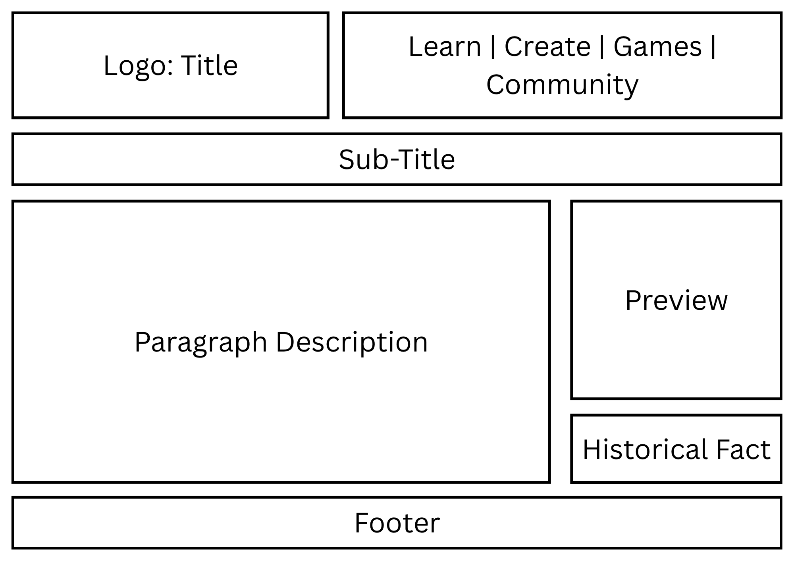
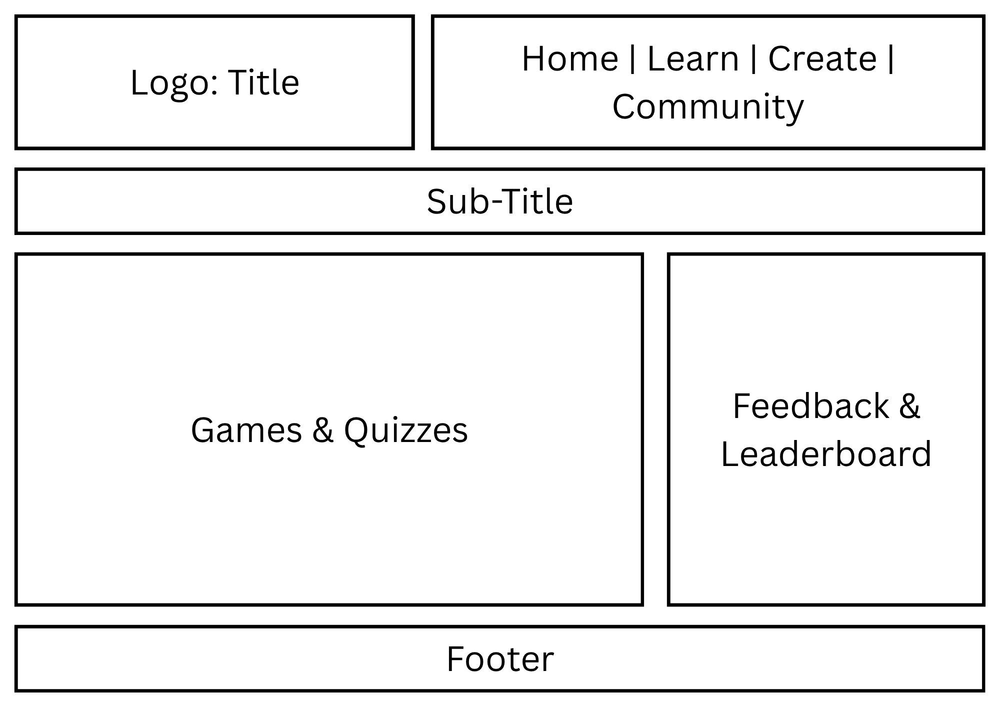

# WDProjMagnesiumLomotanValdriz
The collaborative repository for the project of Valdriz and Lomotan.

# Project Proposal

1. Title: Resonus

2. Sub-Title: Composing Music Throughout the Ages 

3. Logo: 

4. Short but Comprehensive Description of Website: An interactive website where you can make, learn, and enjoy music to the fullest. Know about the history of music and how various people and events throughout the ages shaped music’s legacy and culture until now. Compose music and collaborate with other creators to your heart’s content. Play rhythm games for fun and test your knowledge on music with our quizzes!

5. 

Outline: 

Webpage One: Home

Subtitle: Welcome to Resonus

Description: A page that will have an introduction, a short description of the website itself, and then buttons or links to the other webpages. There will be a preview of the website itself, like a game or music creation tool, and a quick historical fact about music to engage users. There will be a navigation bar on top, leading to all other pages, and a short statement at the end that encourages the user to interact with the website, such as “Learn now about history.” A section of the page will also have a short About Us, talking about the creators of the website, that being us.

Webpage Two: Learn About Music

Subtitle: Explore The History of Rhythm

Description: A page going through the different eras, key composers, and significant events that shaped music, along with famous instruments and important rhythms throughout each period. After each era, links to relevant quizzes which are all in the fifth webpage will be given to test your knowledge.

Webpage Three: Create Music 

Subtitle: Compose Your Own Resonance

Description: A page that allows the user to drag and drop notes, make their own beats and save or play their compositions. There will be an interactive beat or grid sequencer to create melodies and patterns, and virtual instruments such as the pianos and drums will be provided as well. There will be an option that allows you to switch between different periods of time to create music inspired by historical styles, such as jazz or rock. Finally, a link to Community Creations will also be present to allow you to share your compositions.

Webpage Four: Community Creations

Subtitle: Appreciate, Create, and Collaborate Together 

Description: A page where people can share their compositions. Creators can upload, remix, and contribute to shared compositions. There will also be forums where people can discuss and chat with each other, sharing tips about composing music and planning collaborations. Users can also make groups with each other, for multiplayer games. There will be links to both Create Music so users can start composing their own or Games and Quizzes where groups can play the multiplayer games or help each other in the quizzes. Additionally, users can use compositions from this webpage for the games in Games and Quizzes.

Webpage Five: Games and Quizzes

Subtitle: Challenge Your Knowledge and Have Fun

Description: A page where the user will be presented with a load of games and quizzes, both to have fun and to test their knowledge. The games will have them click on notes with timing from historical songs such as Moonlight Sonata or original songs from Community Creations. The quizzes will be of different formats such as multiple choice and true/false, and they will test you  about the history of music, various instruments, facts about composers, and music theory. 

There will be feedback depending on the score the user gets and various difficulties. There will also be a section where users can see their achievements along with a leaderboard that can track progress and other players. There will be links to both Learn About Music and Community Creations for quizzes and games, respectively.

6. Incorporation of JS: JavaScript will be used on the "Create Music" page to make it much more interactive and allow users to make their own rhythms. It would control the system of the page such as sound, user input, tempo, and much more. The user will be able to arrange their beats for JavaScript to store the data and play it back for the maker to hear. Additionally, the use of JavaScript will allow the user to save their own work and upload it to the "Community Creations" page. Lastly, JavaScript will be included to be used in the "Games & Quizzes" page to track player input, scores, and much more.

7. 

Wireframe: 

7. Wireframes

    Home Wireframe:
    Learn Wireframe:
    Create Wireframe:
    Community Wireframe:
    Games Wireframe